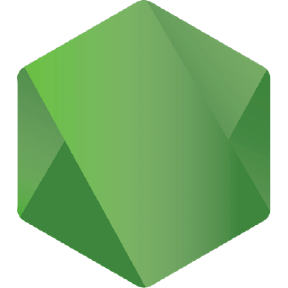

-----

## <i> :wave: <b>Hi</b>, I'm Marcella Chaves

<table>
<tr>
 <td align="center" colspan="11"></td>
</tr> 
<tr>

<td>
</td>
<td>
</td>
<td>
</td>

</tr>
<tr>
 <td align="center" colspan="11"></td>
</tr> 
</table>

-----

Sobre mim:

Olá, sou a <code>Marcella</code>, tenho 20 anos e moro em Belo Horizonte. Sou uma estudante de engenharia de software, atualmente no quinto período na <a href="https://www.pucminas.br/destaques/Paginas/default.aspx?utm_source=google&utm_medium=cpa&utm_campaign=aon-institucional&utm_content=PC00002&gad_source=1&gclid=CjwKCAjwk8e1BhALEiwAc8MHiJ66s56joN9L6Kuvbl90gkXUs0P3SBC0DVm4dBxJ1eJjZ6Ne838X5BoClk4QAvD_BwE" target="_blank">PUC Minas</a>, com muita vontade de aprender e crescer na área. Minha trajetória na faculdade já me proporcionou uma base em programação, principalmente em Java SpringBoot, JavaScript, NodeJS, SQL e estou estudando outras linguagens, como Python. Também aprendi metodologias ágeis, padrões de arquitetura como MVC e DAO, noções de complexidade de código, sistemas operacionais e o uso do Git. Participei, e pretendo continuar participando, de atividades extracurriculares, como projetos de extensão - PUC mais idade, Explorando Tecnologias Emergentes: Oficina de Mini Projetos - e cursos online. Faço parte do laboratório <a href="http://imscience.icei.pucminas.br/" target="_blank">IMScience</a> como bolsista na pesquisa <code>Smart Annotation and Interactive Segmentation Systems for Medical Images</code>.
  
  

-----

Linguagens e ferramentas:
<code></code>
&nbsp; 
<code></code>
&nbsp; 
<code></code>
&nbsp; 
<code></code>
&nbsp; 
<code></code>
&nbsp; 
<code></code>
&nbsp; 
<code></code>
&nbsp; 
<code></code>
&nbsp; 
<code></code>
&nbsp; 
<code></code>
&nbsp; 
<code></code>
&nbsp;
<code></code>
&nbsp; 
<code></code>
&nbsp;

-----
GitHub Stats:

