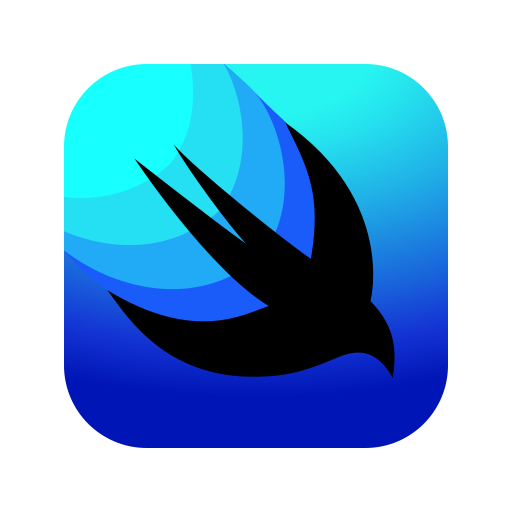

-----

## <i> :wave: <b>Hi</b>, I'm Marcella Chaves

<table>
<tr>
 <td align="center" colspan="11"></td>
</tr> 
<tr>

<td>
</td>
<td>
</td>

</tr>
<tr>
 <td align="center" colspan="11"></td>
</tr> 
</table>

-----

Sobre mim:

Olá, sou a <code>Marcella</code>, tenho 21 anos e moro em Belo Horizonte. Sou estudante de Engenharia de Software na <a href="https://www.pucminas.br">PUC Minas</a>, atualmente no sétimo período, e venho construindo minha trajetória com foco em desenvolvimento de software, especialmente na área mobile iOS.

Ao longo da graduação, desenvolvi uma base em programação com <b>C, Java, JavaScript, Python e Dart</b>, além de experiência em desenvolvimento mobile com <b>SwiftUI</b> e <b>Flutter</b>, e backend com <b>Node.js</b>. Também tive contato com consumo e integração de APIs REST, bancos de dados relacionais como <b>MySQL</b> e <b>PostgreSQL</b>, versionamento com <b>Git/GitHub</b>, testes unitários com <b>XCTest</b>, <b>Jest</b> e <b>JUnit</b>, além de padrões e arquiteturas como <b>MVC</b>, <b>MVVM</b> e <b>DAO</b>.

Participei do <b>HackaTruck MakerSpace</b>, experiência que fortaleceu minha base em Swift, IoT, integração com nuvem e desenvolvimento colaborativo, e em que atuei no desenvolvimento do projeto <code>SmartGarden</code>. Também fui bolsista no laboratório <a href="http://imscience.icei.pucminas.br/">IMScience</a>, participando da pesquisa <code>Smart Annotation and Interactive Segmentation Systems for Medical Images</code>, voltada a sistemas inteligentes de anotação e segmentação interativa de imagens médicas.

Atualmente, trabalho como estagiária de Desenvolvimento de Software iOS na <a href="https://www.dtidigital.com.br">dti digital</a>, desenvolvendo e mantendo funcionalidades com <b>SwiftUI</b> em um produto internacional.

-----

Linguagens e ferramentas:
<code></code>
&nbsp; 
<code></code>
&nbsp; 
<code></code>
&nbsp; 
<code></code>
&nbsp; 
<code></code>
&nbsp; 
<code></code>
&nbsp; 
<code></code>
&nbsp; 
<code></code>
&nbsp; 
<code></code>
&nbsp; 
<code></code>
&nbsp; 
<code></code>
&nbsp; 
<code></code>
&nbsp; 
<code></code>
&nbsp;

